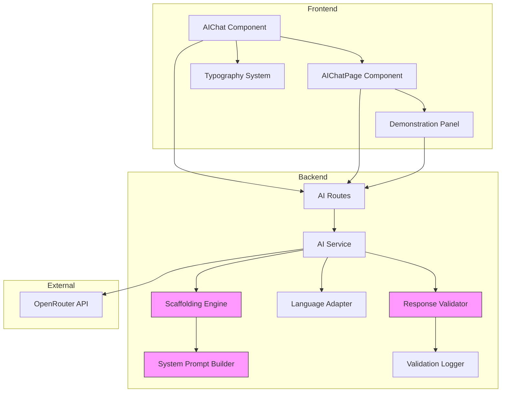

# Design Document: Oracle Mentor Transformation

## Overview

This design transforms the PyPath AI assistant "Oracle" (Оракул) from a standard chatbot into an intelligent mentor that guides students with hints rather than providing complete solutions. The transformation implements scaffolding logic to prevent complete answers, enhances multilingual support for Kazakh and Russian, updates typography for proper Cyrillic rendering, and provides a demonstration layer for project defense.

The system builds upon the existing OpenRouter-based AI service (`backend/app/services/ai_service.py`) and extends the frontend AI chat components (`components/AIChat.tsx`, `components/AIChatPage.tsx`) with new mentor capabilities.

### Key Design Goals

1. Implement scaffolding logic that prevents complete solutions while providing effective guidance
2. Enhance language detection and response quality for Kazakh and Russian
3. Update typography system to Times New Roman with full Cyrillic support
4. Create demonstration interface for showcasing scaffolding implementation
5. Implement logging and verification system for scaffolding rule application
6. Maintain backward compatibility with existing AI chat functionality

## Architecture

### System Components



### Component Responsibilities

1. **Scaffolding Engine**: Constructs system prompts with mentor-mode constraints
2. **Response Validator**: Analyzes AI responses to detect complete solutions
3. **Language Adapter**: Ensures linguistically correct Kazakh/Russian responses
4. **Validation Logger**: Records scaffolding rule applications for verification
5. **Demonstration Panel**: Displays scaffolding implementation for defense
6. **Typography System**: Renders Times New Roman with Cyrillic support

## Components and Interfaces

### Backend Components

#### 1. Scaffolding Engine

**Location**: `backend/app/services/scaffolding_engine.py`

**Purpose**: Constructs system prompts that enforce mentor-mode behavior

**Interface**:
```python
class ScaffoldingEngine:
    def build_mentor_prompt(self, language: str, context: Optional[dict] = None) -> str:
        """Build system prompt with scaffolding constraints"""
        
    def get_scaffolding_rules(self) -> list[ScaffoldingRule]:
        """Return list of active scaffolding rules"""
        
    def classify_request_type(self, user_message: str) -> RequestType:
        """Classify user request (hint, solution, explanation, etc.)"""
```

**Scaffolding Rules**:
- Rule 1: Never provide complete code implementations (>3 lines)
- Rule 2: Never write complete essays or written answers
- Rule 3: Never perform complete calculations
- Rule 4: Always include leading questions in responses
- Rule 5: Provide algorithm descriptions without implementation
- Rule 6: Point to error locations without providing corrections

#### 2. Response Validator

**Location**: `backend/app/services/response_validator.py`

**Purpose**: Validates AI responses comply with scaffolding rules

**Interface**:
```python
class ResponseValidator:
    def validate_response(
        self, 
        response: str, 
        request_type: RequestType,
        rules: list[ScaffoldingRule]
    ) -> ValidationResult:
        """Validate response against scaffolding rules"""
        
    def detect_complete_solution(self, response: str) -> bool:
        """Detect if response contains complete solution"""
        
    def count_code_lines(self, response: str) -> int:
        """Count lines of code in response"""
```

**Validation Logic**:
- Code block detection: Count lines in ```python``` blocks
- Essay detection: Check for paragraph structure and length
- Calculation detection: Look for step-by-step arithmetic
- Question presence: Verify leading questions exist

#### 3. Validation Logger

**Location**: `backend/app/services/validation_logger.py`

**Purpose**: Records scaffolding rule applications for verification

**Interface**:
```python
class ValidationLogger:
    def log_interaction(
        self,
        user_id: str,
        request_type: RequestType,
        validation_result: ValidationResult,
        rules_applied: list[str]
    ) -> None:
        """Log scaffolding validation"""
        
    def get_recent_logs(self, limit: int = 100) -> list[LogEntry]:
        """Retrieve recent validation logs"""
        
    def get_user_logs(self, user_id: str, limit: int = 50) -> list[LogEntry]:
        """Get logs for specific user"""
```

**Log Entry Structure**:
```python
@dataclass
class LogEntry:
    timestamp: datetime
    user_id: str
    request_type: RequestType
    user_message: str
    ai_response: str
    validation_passed: bool
    rules_applied: list[str]
    rules_violated: list[str]
```

#### 4. Enhanced AI Service

**Location**: `backend/app/services/ai_service.py` (modifications)

**New Methods**:
```python
class AIService:
    def chat_with_scaffolding(
        self,
        user_id: str,
        message: str,
        language: str | None = None,
        context: Optional[dict] = None
    ) -> ScaffoldedResponse:
        """Chat with scaffolding validation"""
        
    def get_scaffolding_status(self) -> ScaffoldingStatus:
        """Get current scaffolding configuration"""
```

**Integration Points**:
- Inject scaffolding engine into system prompt building
- Add response validation before returning to user
- Log all interactions through validation logger
- Maintain existing language detection logic

### Frontend Components

#### 1. Enhanced AIChat Component

**Location**: `components/AIChat.tsx` (modifications)

**New Features**:
- Display scaffolding status indicator
- Show hint/guidance badges on AI responses
- Highlight when scaffolding rules are active
- Context-aware scaffolding (practice vs. theory)

**New Props**:
```typescript
interface AIChatProps {
    embedded?: boolean;
    context?: AIChatContext;
    showScaffoldingStatus?: boolean;  // NEW
    enableDemonstration?: boolean;     // NEW
}
```

#### 2. Demonstration Panel Component

**Location**: `components/DemonstrationPanel.tsx` (new)

**Purpose**: Display scaffolding implementation for project defense

**Interface**:
```typescript
interface DemonstrationPanelProps {
    visible: boolean;
    onClose: () => void;
}

export const DemonstrationPanel: React.FC<DemonstrationPanelProps>
```

**Features**:
- Display current system prompt with scaffolding rules
- Show real-time scaffolding rule application
- Display validation logs
- Provide example interactions (hint vs. complete solution)
- Highlight scaffolding logic in code view

#### 3. Typography System Updates

**Location**: `styles.css` (modifications)

**Changes**:
```css
/* Add Times New Roman font family */
body, input, textarea, button {
    font-family: 'Times New Roman', Tinos, 'Liberation Serif', serif;
}

/* Ensure Cyrillic character support */
@font-face {
    font-family: 'Times New Roman';
    src: local('Times New Roman'),
         local('TimesNewRoman'),
         local('Times');
    unicode-range: U+0400-04FF, U+0500-052F;  /* Cyrillic blocks */
}

/* Specific support for Kazakh extended characters */
.kazakh-text {
    font-feature-settings: "locl" 1;  /* Enable localized forms */
}
```

### API Endpoints

#### 1. Enhanced Chat Endpoint

**Endpoint**: `POST /api/ai/chat`

**Request**:
```json
{
    "message": "string",
    "user_id": "string",
    "chat_id": "string?",
    "language": "kz | ru?",
    "context": {
        "courseTitle": "string?",
        "practiceName": "string?",
        "lastError": "string?"
    },
    "enable_scaffolding": true
}
```

**Response**:
```json
{
    "response": "string",
    "timestamp": "string",
    "scaffolding_applied": true,
    "request_type": "hint | solution | explanation",
    "rules_applied": ["rule1", "rule2"]
}
```

#### 2. Scaffolding Status Endpoint

**Endpoint**: `GET /api/ai/scaffolding/status`

**Response**:
```json
{
    "enabled": true,
    "rules": [
        {
            "id": "rule1",
            "description": "Never provide complete code implementations",
            "active": true
        }
    ],
    "system_prompt_preview": "string"
}
```

#### 3. Validation Logs Endpoint

**Endpoint**: `GET /api/ai/scaffolding/logs`

**Query Parameters**:
- `user_id`: string (optional)
- `limit`: number (default: 100)

**Response**:
```json
{
    "logs": [
        {
            "timestamp": "string",
            "user_id": "string",
            "request_type": "hint",
            "validation_passed": true,
            "rules_applied": ["rule1", "rule4"]
        }
    ]
}
```

## Data Models

### Scaffolding Rule

```python
@dataclass
class ScaffoldingRule:
    id: str
    description: str
    constraint_type: ConstraintType  # CODE | ESSAY | CALCULATION | QUESTION
    max_code_lines: int | None = None
    max_paragraph_count: int | None = None
    requires_question: bool = False
    active: bool = True
```

### Request Type

```python
class RequestType(Enum):
    HINT = "hint"              # User asks for hint
    SOLUTION = "solution"      # User asks for complete solution
    EXPLANATION = "explanation"  # User asks for explanation
    ERROR_HELP = "error_help"  # User reports error
    THEORY = "theory"          # User asks about theory
    MOTIVATION = "motivation"  # User needs motivation
```

### Validation Result

```python
@dataclass
class ValidationResult:
    passed: bool
    request_type: RequestType
    rules_applied: list[str]
    rules_violated: list[str]
    code_line_count: int
    has_leading_question: bool
    is_complete_solution: bool
    confidence_score: float  # 0.0 to 1.0
```

### Scaffolded Response

```python
@dataclass
class ScaffoldedResponse:
    response: str
    timestamp: str
    scaffolding_applied: bool
    request_type: RequestType
    validation_result: ValidationResult
    rules_applied: list[str]
```

## Correctness Properties

*A property is a characteristic or behavior that should hold true across all valid executions of a system—essentially, a formal statement about what the system should do. Properties serve as the bridge between human-readable specifications and machine-verifiable correctness guarantees.*

Before writing correctness properties, I need to analyze the acceptance criteria for testability using the prework tool:

<function_calls>
<invoke name="prework">
<parameter name="featureName">oracle-mentor-transformation


### Property 1: Hint Responses Structure

*For any* coding problem request, the hint response SHALL contain at least one leading question (indicated by '?') AND all code blocks SHALL be limited to maximum 3 lines.

**Validates: Requirements 1.1, 8.1, 8.2, 8.4**

### Property 2: No Complete Solutions

*For any* user request, the system response SHALL NOT contain code blocks exceeding 3 lines OR complete function implementations OR complete class definitions.

**Validates: Requirements 1.2**

### Property 3: Essay Guidance Structure

*For any* essay or written answer request, the response SHALL contain structural elements (outlines, key points, bullet lists) AND SHALL NOT contain multiple complete paragraphs forming a full essay.

**Validates: Requirements 1.3**

### Property 4: Calculation Approach Without Solution

*For any* calculation request, the response SHALL contain formula explanations or approach descriptions AND SHALL NOT contain complete step-by-step arithmetic solutions with final answers.

**Validates: Requirements 1.4**

### Property 5: Validator Detects Complete Solutions

*For any* response text, the response validator SHALL correctly classify whether it contains a complete solution (code >3 lines, complete essays, or complete calculations) with confidence score >0.8.

**Validates: Requirements 1.6**

### Property 6: Request Type Logging

*For any* user request processed by the Oracle system, a log entry SHALL be created containing the classified request type (hint, solution, explanation, error_help, theory, or motivation).

**Validates: Requirements 3.1**

### Property 7: Validation Result Logging

*For any* response validation performed, a log entry SHALL be created containing the validation result (passed or failed) and the timestamp.

**Validates: Requirements 3.2**

### Property 8: Log Size Bounded

*For any* sequence of interactions exceeding 100 entries, the validation log SHALL contain exactly the 100 most recent entries (oldest entries are removed).

**Validates: Requirements 3.3**

### Property 9: Log Entries Contain Applied Rules

*For any* log entry created, it SHALL contain a non-empty list of scaffolding rule IDs that were applied during validation.

**Validates: Requirements 3.5**

### Property 10: Kazakh Language Detection

*For any* message containing at least one Kazakh extended character (ә, і, ң, ғ, ү, ұ, қ, ө, һ), the language adapter SHALL detect the language as "kz".

**Validates: Requirements 4.1**

### Property 11: Kazakh Language Purity

*For any* response generated in Kazakh language, the response text (excluding code blocks) SHALL NOT contain Russian Cyrillic characters that are not part of Kazakh alphabet OR English words.

**Validates: Requirements 4.2, 4.5**

### Property 12: Russian Language Detection

*For any* message containing Cyrillic characters but NO Kazakh extended characters, the language adapter SHALL detect the language as "ru".

**Validates: Requirements 5.1**

### Property 13: Russian Language Purity

*For any* response generated in Russian language, the response text (excluding code blocks) SHALL NOT contain Kazakh extended characters OR English words.

**Validates: Requirements 5.2, 5.5**

### Property 14: Russian Cyrillic Rendering

*For any* text containing Russian Cyrillic characters (А-Я, а-я), when rendered in the typography system, NO character SHALL be replaced with replacement symbols (□, ?, �).

**Validates: Requirements 7.1**

### Property 15: Kazakh Character Rendering

*For any* text containing Kazakh extended characters (ә, і, ң, ғ, ү, ұ, қ, ө, һ), when rendered in the typography system, NO character SHALL be replaced with replacement symbols (□, ?, �).

**Validates: Requirements 7.2, 7.3**

### Property 16: Cyrillic Case Support

*For any* Cyrillic character (Russian or Kazakh), both uppercase and lowercase variants SHALL render correctly without replacement symbols.

**Validates: Requirements 7.4**

### Property 17: Input Field Cyrillic Rendering

*For any* input element (input, textarea) containing Kazakh extended characters, the displayed text SHALL match the input value character-for-character with no replacement symbols.

**Validates: Requirements 7.5**

### Property 18: Error Help Without Corrections

*For any* error help request, the response SHALL mention the error location or type AND SHALL NOT contain corrected code implementations.

**Validates: Requirements 8.3**

### Property 19: Progressive Hints Maintain Scaffolding

*For any* sequence of hint requests for the same problem, each subsequent hint SHALL be more specific than the previous (measured by information content) AND SHALL still maintain scaffolding constraints (no complete solutions).

**Validates: Requirements 8.5**

### Property 20: System Prompt Parsing

*For any* valid system prompt configuration text, the parser SHALL successfully parse it into a structured configuration object without throwing exceptions.

**Validates: Requirements 9.1**

### Property 21: Parser Error Handling

*For any* invalid system prompt configuration text, the parser SHALL return a descriptive error message (not throw an exception) that indicates what is invalid.

**Validates: Requirements 9.2**

### Property 22: Configuration Serialization

*For any* valid configuration object, the pretty printer SHALL format it into valid system prompt text that can be parsed back.

**Validates: Requirements 9.3**

### Property 23: Configuration Round-Trip

*For any* valid system prompt configuration text, parsing then printing then parsing SHALL produce a configuration object equivalent to the result of parsing the original text once.

**Validates: Requirements 9.4**

### Property 24: Required Rules Validation

*For any* system prompt configuration, the parser SHALL validate that all required scaffolding rules (code limit, essay limit, calculation limit, question requirement) are present and return an error if any are missing.

**Validates: Requirements 9.5**

## Error Handling

### Scaffolding Validation Failures

When the response validator detects a complete solution:

1. **Logging**: Log the violation with full details (user_id, request, response, violated rules)
2. **Fallback Response**: Replace the complete solution with a generic hint message
3. **Alert**: Notify administrators of repeated validation failures
4. **User Feedback**: Inform user that response was filtered for educational purposes

**Fallback Messages**:
- Kazakh: "Кешіріңіз, толық шешімді бере алмаймын. Міне кеңес: [generic hint]"
- Russian: "Извини, не могу дать полное решение. Вот подсказка: [generic hint]"

### Language Detection Failures

When language cannot be confidently detected:

1. **Default to Russian**: Use Russian as fallback language
2. **Log Ambiguity**: Record the ambiguous message for analysis
3. **User Prompt**: Ask user to specify language preference

### Typography Rendering Failures

When Cyrillic characters fail to render:

1. **Font Fallback Chain**: Times New Roman → Tinos → Liberation Serif → system serif
2. **Character Substitution**: Use closest available glyph
3. **Error Reporting**: Log rendering failures for font debugging

### API Failures

When OpenRouter API is unavailable:

1. **Retry Logic**: Retry up to 3 times with exponential backoff
2. **Fallback Responses**: Use predefined quick responses
3. **User Notification**: Inform user of temporary unavailability
4. **Graceful Degradation**: Disable scaffolding validation if necessary

### Parser Failures

When system prompt parsing fails:

1. **Use Default Prompt**: Fall back to hardcoded default scaffolding rules
2. **Log Error**: Record parsing error with full configuration text
3. **Admin Alert**: Notify administrators of configuration issues
4. **Validation Skip**: Temporarily disable custom scaffolding rules

## Testing Strategy

### Unit Testing

**Scaffolding Engine Tests**:
- Test system prompt construction with various languages
- Test request type classification accuracy
- Test scaffolding rule activation/deactivation
- Test context-aware prompt building

**Response Validator Tests**:
- Test code line counting with various code block formats
- Test complete solution detection with edge cases
- Test essay structure detection
- Test calculation detection patterns

**Language Adapter Tests**:
- Test Kazakh character detection with mixed text
- Test Russian detection with Cyrillic-only text
- Test language purity validation
- Test fallback language selection

**Validation Logger Tests**:
- Test log entry creation and storage
- Test log size bounding (100 entry limit)
- Test log retrieval by user and time range
- Test concurrent logging from multiple users

### Property-Based Testing

This feature is suitable for property-based testing as it involves:
- Text processing and validation (parsers, validators)
- Universal properties that should hold across all inputs
- Data transformations (configuration parsing/serialization)
- Stateful behavior (logging, progressive hints)

**Property Test Configuration**:
- Library: `hypothesis` (Python), `fast-check` (TypeScript)
- Minimum iterations: 100 per property
- Each test tagged with: `Feature: oracle-mentor-transformation, Property {number}: {property_text}`

**Property Test Implementation**:

```python
# Example property test for Property 2: No Complete Solutions
from hypothesis import given, strategies as st

@given(st.text(min_size=10, max_size=1000))
def test_no_complete_solutions(user_request: str):
    """
    Feature: oracle-mentor-transformation, Property 2: No Complete Solutions
    For any user request, the system response SHALL NOT contain code blocks 
    exceeding 3 lines OR complete function implementations.
    """
    response = ai_service.chat_with_scaffolding(
        user_id="test_user",
        message=user_request,
        language="ru"
    )
    
    # Extract code blocks
    code_blocks = extract_code_blocks(response.response)
    
    # Verify no code block exceeds 3 lines
    for block in code_blocks:
        lines = block.strip().split('\n')
        assert len(lines) <= 3, f"Code block exceeds 3 lines: {len(lines)}"
    
    # Verify no complete function definitions
    assert not contains_complete_function(response.response)
```

**Property Test Coverage**:
- Properties 1-5: Scaffolding constraints (100 iterations each)
- Properties 6-9: Logging behavior (100 iterations each)
- Properties 10-13: Language detection and purity (100 iterations each)
- Properties 14-17: Typography rendering (100 iterations each)
- Properties 18-19: Hint behavior (100 iterations each)
- Properties 20-24: Configuration parsing (100 iterations each)

### Integration Testing

**End-to-End Scaffolding Flow**:
1. User sends coding problem request
2. System classifies request type
3. Scaffolding engine builds mentor prompt
4. OpenRouter generates response
5. Response validator checks for complete solutions
6. Validation logger records interaction
7. Response returned to user

**Language Quality Testing**:
- Manual review of Kazakh responses by native speakers
- Manual review of Russian responses by native speakers
- Terminology appropriateness assessment
- Grammar and style consistency checks

**Typography Testing**:
- Cross-browser rendering tests (Chrome, Firefox, Safari)
- Cross-platform tests (Windows, Mac, Linux)
- Font fallback verification
- Character substitution testing

**Demonstration Layer Testing**:
- Verify system prompt display
- Verify real-time rule application display
- Verify log access and filtering
- Verify example interactions display

### Performance Testing

**Response Time Targets**:
- Scaffolding validation: <50ms
- Language detection: <10ms
- Log entry creation: <20ms
- System prompt building: <30ms

**Load Testing**:
- 100 concurrent users sending requests
- Validation logger handles 1000 entries/second
- Log retrieval <200ms for 100 entries

### Acceptance Testing

**Scaffolding Effectiveness**:
- Students report receiving helpful hints (>80% satisfaction)
- Students do not receive complete solutions (0% complete solution rate)
- Progressive hints lead to problem solving (>70% success rate)

**Language Quality**:
- Native speakers rate responses as natural (>4/5 rating)
- No language mixing detected in responses (0% mixing rate)
- Terminology appropriate for educational context (>4/5 rating)

**Typography Quality**:
- All Cyrillic characters render correctly (100% success rate)
- Font consistency across browsers (visual regression tests pass)
- No replacement symbols in production (0% replacement rate)

## Implementation Notes

### Phase 1: Backend Scaffolding (Week 1)

1. Create `scaffolding_engine.py` with system prompt builder
2. Create `response_validator.py` with solution detection
3. Create `validation_logger.py` with log management
4. Modify `ai_service.py` to integrate scaffolding
5. Add new API endpoints for scaffolding status and logs
6. Write unit tests for all new components

### Phase 2: Frontend Integration (Week 2)

1. Update `AIChat.tsx` with scaffolding status display
2. Create `DemonstrationPanel.tsx` component
3. Update `styles.css` with Times New Roman typography
4. Add Cyrillic font support and fallbacks
5. Integrate demonstration panel into admin interface
6. Write component tests

### Phase 3: Language Enhancement (Week 3)

1. Enhance language detection with Kazakh character recognition
2. Add language purity validation to response validator
3. Update system prompts with stronger language enforcement
4. Test with native Kazakh and Russian speakers
5. Refine prompts based on feedback

### Phase 4: Testing & Refinement (Week 4)

1. Implement property-based tests for all 24 properties
2. Run integration tests end-to-end
3. Conduct performance testing and optimization
4. Manual testing with real students
5. Documentation and demonstration preparation

### Migration Strategy

**Backward Compatibility**:
- Existing AI chat functionality remains unchanged
- Scaffolding is opt-in via `enable_scaffolding` parameter
- Gradual rollout to user segments
- A/B testing to measure effectiveness

**Data Migration**:
- No database schema changes required
- Existing chat history preserved
- New validation logs stored in user settings JSON
- Log retention policy: 30 days

### Security Considerations

**Prompt Injection Prevention**:
- Sanitize user input before including in prompts
- Validate that user messages don't contain system prompt override attempts
- Log suspicious patterns for review

**Log Privacy**:
- Validation logs contain user messages - ensure proper access control
- Admin-only access to full logs
- Anonymize logs for analytics
- GDPR compliance for log retention

**Demonstration Layer Access**:
- Restrict demonstration panel to admin users only
- Require authentication for scaffolding status endpoint
- Rate limit log retrieval endpoints

### Monitoring & Metrics

**Key Metrics**:
- Scaffolding validation pass rate (target: >95%)
- Complete solution detection rate (target: <5% false negatives)
- Language detection accuracy (target: >99%)
- Response time with scaffolding (target: <2s)
- Student satisfaction with hints (target: >80%)

**Alerts**:
- Alert when validation pass rate drops below 90%
- Alert when complete solutions detected in production
- Alert when language mixing exceeds 1%
- Alert when response times exceed 3s

**Dashboards**:
- Real-time scaffolding validation metrics
- Language detection distribution (kz vs ru)
- Most frequently applied scaffolding rules
- Validation failure patterns

## Conclusion

This design transforms the Oracle AI assistant into an intelligent mentor through:

1. **Scaffolding Logic**: Prevents complete solutions while providing effective guidance
2. **Language Quality**: Ensures linguistically correct Kazakh and Russian responses
3. **Typography**: Proper Cyrillic rendering with Times New Roman
4. **Demonstration**: Showcases implementation for project defense
5. **Validation**: Comprehensive logging and verification system

The implementation maintains backward compatibility, follows property-based testing principles, and provides measurable quality metrics. The system is designed for gradual rollout with A/B testing to validate effectiveness before full deployment.
